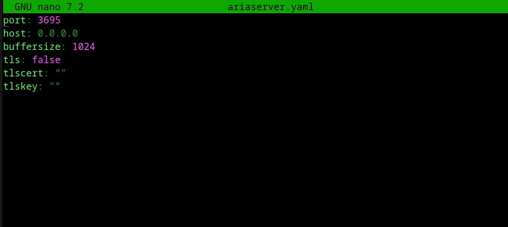
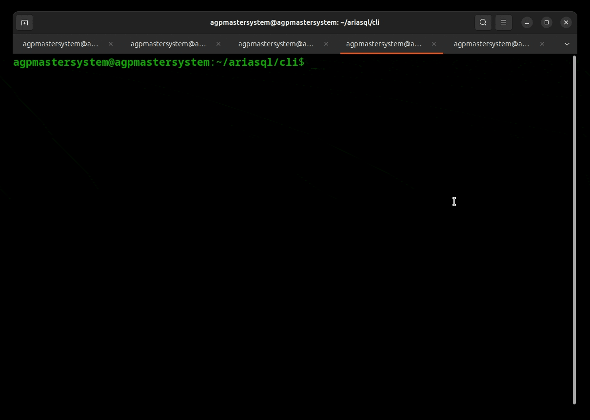
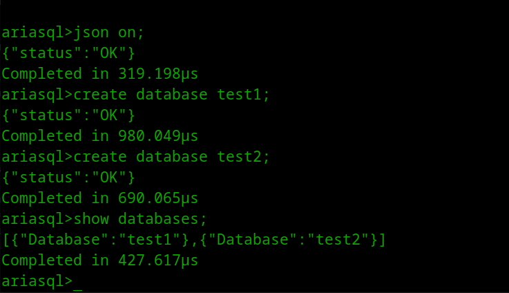

<div>
    <h1 align="center"></h1>
</div>

AriaSQL is an open source relational database server.  AriaSQL is designed to be lightweight and fast with a focus on simplicity and ease of use.

> [!WARNING]
> Still in beta stages, use at your own risk.

## Features
- [x] SQL1+ handwritten parser, lexer implementation
- [x] BTrees for indexes
- [x] Optimized execution engine / compiler
- [x] SQL Server (TCP Server on port `3695`)
- [x] User authentication and privileges
- [x] Atomic transactions with rollback support on error
- [x] WAL (Write Ahead Logging)
- [x] Recovery-Replay from WAL
- [x] Subqueries
- [x] Aggregates
- [x] Implicit joins
- [x] Row level locking
- [x] Users and privileges
- [x] CLI (asql)
- [x] TLS Support
- [x] JSON response format (false by default)
- [x] Foreign keys
- [x] DML, DQL, DDL, DCL, TCL Support

## Whats coming?
- [ ] LEFT, RIGHT, INNER JOIN, CROSS JOIN, NATURAL JOIN, FULL OUTER JOIN
- [ ] Views
- [ ] Triggers
- [ ] Stored Procedures
- [ ] Functions (UPPER, LOWER, CAST, COALESCE, REVERSE, FORMAT, ROUND, POSITION, LENGTH, REPLACE, CONCAT, SUBSTRING, TRIM)
- [ ] Cursors
- [ ] DATE, TIME, TIMESTAMP, DATETIME, UUID data types
- [ ] Roles

## Clients/Drivers
No official clients/drivers are available at this time.

## User Guide
The user guide will be released with the first stable release of AriaSQL for now it's best to reference executor tests or SQL1+ standard.

## Getting Started

The default user is `admin` with password `admin`.
This user has all privileges.

To update the password for the `admin` user, run the following SQL command:

```
ALTER USER admin SET PASSWORD 'newpassword';

-- To update a username
ALTER USER admin SET USERNAME 'newusername';
```

### The Server
The AriaSQL server starts when executing the binary.

```
./ariasql
```

When starting AriaSQL for the first time a variety of files will be created as seen below.
<div>
    <h1 align="center"></h1>
</div>

- ariaserver.yaml - The server configuration file.
- databases/ - The directory where databases and their data are stored.
- users.usrs - The file where users and their privileges are stored.
- wal.dat - The Write Ahead Log file.
- wal.dat.del - The Write Ahead Log file for deleted records. (Generated by underlaying pager)

#### Data directories
##### Windows

```
os.Getenv("ProgramData") + GetOsPathSeparator() + "AriaSQL"

i.e C:\ProgramData\AriaSQL
```

##### MacOS

```
/Library/Application Support/AriaSQL
```

##### Linux

```
/var/lib/ariasql
```


### Communicating with server
AriaSQL server uses a basic auth like mechanism to authenticate users.
The server listens on port `3695` for incoming connections.

You can configure your server settings in the `ariaserver.yaml` file.
<div>
    <h1 align="center"></h1>
</div>


You must encode the username and password in base64 similar to SMTP.

```
echo -n "admin\0admin" | base64

Above for example would be your base64 encoded auth string.

If you're using netcat simply pass the base64 encoded string as the first line.
```

#### Using asql - AriaSQL CLI
```
./asql -u admin -p admin -host localhost -port 3695 -tls false
```
All but username and password are optional.


<div>
    <h1 align="center"></h1>
</div>

### Setting server for JSON responses

You can execute `json on` or `json off` from client programs.


<div>
    <h1 align="center"></h1>
</div>


### SQL
AriaSQL Supports SQL1

#### Data Types
- INT
- INTEGER
- SMALLINT
- CHAR
- CHARACTER
- FLOAT
- DOUBLE
- DECIMAL
- DEC
- REAL
- NUMERIC

#### Constraints
- UNIQUE
- NOT NULL

#### Aggregates
- COUNT
- SUM
- AVG
- MIN
- MAX

#### Create

##### Create Database
```
CREATE DATABASE test;
```

##### Create Table
```
CREATE TABLE test (id INT NOT NULL UNIQUE, name CHAR(255));
```

##### Create Index
```
CREATE INDEX test_id ON test (id);
```

#### Show
```
SHOW DATABASES;
SHOW TABLES;
SHOW USERS;
```

#### Insert
```
INSERT INTO test (id, name) VALUES (1, 'test'), (2, 'test2');
```

#### Select
```
SELECT * FROM test;
```

#### Update
```
UPDATE test SET name = 'test3' WHERE id = 1;
```

#### Delete

```
DELETE FROM test WHERE id = 1;
```

#### Drop

```
DROP TABLE test;
DROP DATABASE test;
DROP INDEX test_id;
```

#### Grant

```
GRANT SELECT, INSERT, UPDATE, DELETE ON dbname.tablename TO user;
```

All

```
GRANT ALL ON *.* TO someusername;
```

#### Revoke

```
REVOKE SELECT, INSERT, UPDATE, DELETE ON dbname.tablename FROM user;
```

All

```
REVOKE ALL ON test FROM someusername;
```

#### Users

```
CREATE USER someusername WITH PASSWORD 'test';
```

#### Privileges

```
GRANT ALL ON dbname.* TO someusername;
```

#### Transactions
If a statement within a transaction fails, the transaction will be rolled back.

```
BEGIN;
INSERT INTO test (id, name) VALUES (1, 'test'), (2, 'test2');
COMMIT;
```

#### Rollback

```
BEGIN;
INSERT INTO test (id, name) VALUES (1, 'test'), (2, 'test2');
ROLLBACK;
```

For further examples, please see executor tests or ANSI SQL1 standard.

## Issues & Requests

Please report any issues or feature requests as an issue on this repository.

## License
AriaSQL is licensed under the AGPL-3.0 license.
