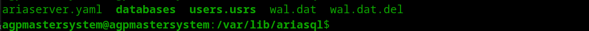

<div>
    <h1 align="center"></h1>
</div>

AriaSQL is a relational database management system designed and engineered from the ground up from scratch to address a variety of data management needs with ease and efficiency.  At its core, AriaSQL is a database server that supports a range of SQL functionalities with a focus on delivering predictability, efficient query execution and data integrity.

> [!WARNING]
> Still in beta stages, use at your own risk.

## Features
- [x] SQL1+ handwritten parser, lexer implementation (AriaSQL follows majority of SQL1 standard with some minor upgrades)
- [x] BTrees for indexes
- [x] Optimized execution engine / compiler
- [x] SQL Server (TCP Server on port `3695`)
- [x] User authentication and privileges
- [x] Atomic transactions with rollback support on error
- [x] WAL (Write Ahead Logging)
- [x] Recovery-Replay from WAL
- [x] Subqueries
- [x] Aggregates
- [x] Implicit joins
- [x] Row level locking
- [x] Users and privileges
- [x] CLI (asql)
- [x] TLS Support
- [x] JSON response format (false by default)
- [x] Foreign keys
- [x] DML, DQL, DDL, DCL, TCL Support
- [x] Stored Procedures
- [x] Cursors
- [x] Execution Plan using EXPLAIN - (Explains course of action for a query, shows order of operations, selected tables, and indexes to use if any or if a full table scan is required)
- [x] CASE expressions (Within select list and where clauses)
- [x] Functions (UPPER, LOWER, CAST, COALESCE, REVERSE, ROUND, POSITION, LENGTH, REPLACE, CONCAT, SUBSTRING, TRIM) `functions used with SELECT within a where clause or select list, i.e SELECT * FROM table WHERE UPPER(column) = 'TEST'`
- [x] DATE, TIME, TIMESTAMP, DATETIME, UUID, BINARY, BOOL/BOOLEAN, TEXT, BLOB data types
- [x] DEFAULT constraint
- [x] CHECK constraint
- [x] GENERATE_UUID, SYS_DATE, SYS_TIME, SYS_TIMESTAMP `functions which can be used with CREATE TABLE, or INSERT INTO, UPDATE, SELECT`
- [x] Logging to file (aria.log)
- [ ] Alter table (migration)
- [ ] Replication - Replication to slave nodes, replicates data from master to slave nodes.
- [ ] Encryption (ChaCha20) - After data is compressed it can be encrypted for storage
- [ ] Compression (ZSTD) - Compresses row data for storage


## Clients/Drivers
- GO - [github.com/ariasql/ariasql-go](https://github.com/ariasql/ariasql-go) `IN DEVELOPMENT`
- Python - [github.com/ariasql/ariasql-py](https://github.com/ariasql/ariasql-py)  `IN DEVELOPMENT`
- NodeJS - [github.com/ariasql/ariasql-node](https://github.com/ariasql/ariasql-node)  `IN DEVELOPMENT`
- Java - [github.com/ariasql/ariasql-java](https://github.com/ariasql/ariasql-java)  `IN DEVELOPMENT`
- Ruby - [github.com/ariasql/ariasql-ruby](https://github.com/ariasql/ariasql-ruby)  `IN DEVELOPMENT`
- PHP - [github.com/ariasql/ariasql-php](https://github.com/ariasql/ariasql-php)  `IN DEVELOPMENT`
- Rust - [github.com/ariasql/ariasql-rust](https://github.com/ariasql/ariasql-rust)  `IN DEVELOPMENT`
- C - [github.com/ariasql/ariasql-c](https://github.com/ariasql/ariasql-c)  `IN DEVELOPMENT`
- C# - [github.com/ariasql/ariasql-csharp](https://github.com/ariasql/ariasql-csharp)  `IN DEVELOPMENT`
- Objective-C - [github.com/ariasql/ariasql-objc](https://github.com/ariasql/ariasql-objc)  `IN DEVELOPMENT`
- C++ - [github.com/ariasql/ariasql-cpp](https://github.com/ariasql/ariasql-cpp)  `IN DEVELOPMENT`
- Swift - [github.com/ariasql/ariasql-swift](https://github.com/ariasql/ariasql-swift)  `IN DEVELOPMENT`
- Kotlin - [github.com/ariasql/ariasql-kotlin](https://github.com/ariasql/ariasql-kotlin)  `IN DEVELOPMENT`
- Scala - [github.com/ariasql/ariasql-scala](https://github.com/ariasql/ariasql-scala)  `IN DEVELOPMENT`
- Perl - [github.com/ariasql/ariasql-perl](https://github.com/ariasql/ariasql-perl)  `IN DEVELOPMENT`
- Lua - [github.com/ariasql/ariasql-lua](https://github.com/ariasql/ariasql-lua)  `IN DEVELOPMENT`
- R - [github.com/ariasql/ariasql-r](https://github.com/ariasql/ariasql-r)  `IN DEVELOPMENT`
- Julia - [github.com/ariasql/ariasql-julia](https://github.com/ariasql/ariasql-julia)  `IN DEVELOPMENT`
- Dart - [github.com/ariasql/ariasql-dart](https://github.com/ariasql/ariasql-dart)  `IN DEVELOPMENT`


## GUI
- AriaSQL Developer - [github.com/ariasql/developer]() `IN DEVELOPMENT`

## User Guide
The user guide will be released with the first stable release of AriaSQL for now it's best to reference executor tests or SQL1+ standard.

## Getting Started

The default user is `admin` with password `admin`.
This user has all privileges.

To update the password for the `admin` user, run the following SQL command:

```
ALTER USER admin SET PASSWORD 'newpassword';

-- To update a username
ALTER USER admin SET USERNAME 'newusername';
```

### The Server
The AriaSQL server starts when executing the binary.

```
./ariasql
```

When starting AriaSQL for the first time a variety of files will be created as seen below.
<div>
    <h1 align="center"></h1>
</div>

- ariaserver.yaml - The server configuration file.
- databases/ - The directory where databases and their data are stored.
- users.usrs - The file where users and their privileges are stored.
- wal.dat - The Write Ahead Log file.
- wal.dat.del - The Write Ahead Log file for deleted records. (Generated by underlaying pager)

#### Data directories
##### Windows

```
os.Getenv("ProgramData") + GetOsPathSeparator() + "AriaSQL"

i.e C:\ProgramData\AriaSQL
```

##### MacOS

```
/Library/Application Support/AriaSQL
```

##### Linux

```
/var/lib/ariasql
```


### Communicating with server
AriaSQL server uses a basic auth like mechanism to authenticate users.
The server listens on port `3695` for incoming connections.

You can configure your server settings in the `ariaserver.yaml` file.
<div>
    <h1 align="center"></h1>
</div>


You must encode the username and password in base64 similar to SMTP.

```
echo -n "admin\0admin" | base64

Above for example would be your base64 encoded auth string.

If you're using netcat simply pass the base64 encoded string as the first line.
```

#### Using asql - AriaSQL CLI
```
./asql -u admin -p admin -host localhost -port 3695 -tls false
```
All but username and password are optional.


<div>
    <h1 align="center"></h1>
</div>

### Setting server for JSON responses

You can execute `json on` or `json off` from client programs.


<div>
    <h1 align="center"></h1>
</div>

## Issues & Requests

Please report any issues or feature requests as an issue on this repository.

## License
AriaSQL is licensed under the AGPL-3.0 license.
